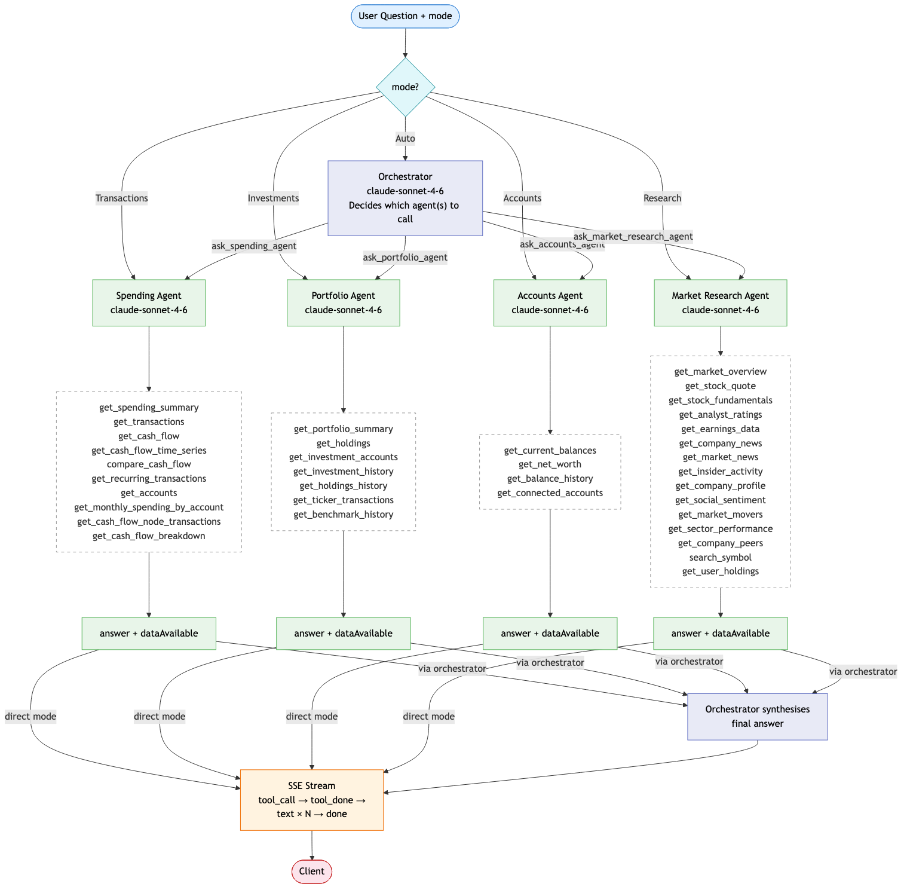

# Plan: Multi-Agent Financial Analysis System

## System Diagram



---

## Context

The app already has a single flat agent (`server/agent/`) with 2 spending-focused tools and a rough `mode` hint for routing ("Transactions", "Investments", etc.). The goal is to refactor this into a scalable multi-agent architecture that:
- Routes questions to specialized sub-agents based on domain
- Scales to new agent types without touching core orchestration logic
- Uses Anthropic's recommended Orchestrator-Workers pattern
- Synthesizes answers from multiple agents when a question spans domains

---

## What Already Exists (Don't Recreate)

| File | What's there | Action |
|------|-------------|--------|
| `server/agent/chat.js` | `runChat()` and `runDemoChat()` — main loop, 5-iteration limit, mode addenda | MODIFY |
| `server/agent/tools.js` | `TOOL_DEFINITIONS` array + `executeTool()` dispatcher | DELETE — spending tools move to `spendingAgent.js`; nothing remains |
| `server/agent/queries.js` | `getAgentSpendingSummary()`, `getAgentTransactions()` | MODIFY — fix exclusion list, add `getAgentCashFlow` |
| `server/routes/agent.js` | `POST /api/agent/chat` route (auth via `req.uid`) | MODIFY |
| `server/agent/system-prompt.md` | Base system prompt | DELETE — each agent has its own inline system prompt; this file becomes dead code |
| `server/db.js` | All the DB query functions we'll call from tools | KEEP, read-only |

---

## Design Principles (from Anthropic's "Building Effective Agents")

1. **Start simple** — use the frontend's `mode` param as the primary router; for `mode="Auto"` the orchestrator figures out which agent(s) to call — no separate classifier needed
2. **Sub-agents as tools** — the orchestrator calls sub-agents as tools in its own loop, so it naturally synthesizes results without a separate merge step
3. **Parallelize independent agents** — when multiple agents are needed, run them with `Promise.all()`, not sequentially
4. **Tool descriptions are critical** — invest in thorough tool descriptions (what it returns, when to use it, edge cases); this is where quality wins come from
5. **Graceful degradation** — each sub-agent returns `{ answer, dataAvailable, error? }` so the orchestrator can tell the user "no investment data linked yet" rather than hallucinating
6. **Self-registering agents** — new agents register themselves; no changes to core orchestration files when adding a new domain
7. **Streaming is surgical** — sub-agents (known mode) use `messages.create()` and yield the final answer as a single chunk after tool steps complete. The user-facing UX win is the thinking steps, not token streaming. The orchestrator uses `messages.stream()` for its final synthesis turn only — that call has no tool use, so streaming is natural and adds real value for longer synthesis responses. Both paths emit `tool_call`/`tool_done` events for the thinking-steps UI.
8. **Mode is a strong hint, not a hard constraint** — `mode` maps directly to an agent for known domains; if the mapped agent returns `dataAvailable: false` or the question clearly belongs to another domain, fall back to Auto routing

---

## New File Structure

```
server/agent/
  chat.js               ← MODIFY: replace mode addenda with registry-based orchestration
  tools.js              ← KEEP: shared base tool utilities
  queries.js            ← MODIFY: add portfolio query functions
  system-prompt.md      ← KEEP: base context
  registry.js           ← NEW: agent registry (self-registration, dynamic tool list)

  agents/
    orchestrator.js     ← NEW: full agentic loop; sub-agents are its tools
    spendingAgent.js    ← NEW: spending sub-agent + its tools
    portfolioAgent.js   ← NEW: portfolio sub-agent + its tools
    index.js            ← NEW: imports all agents so they auto-register on startup
```

To add a future agent (e.g. budgeting, net worth, tax): **create one file in `agents/`** and call `registerAgent()`. Nothing else changes.

---

## Architecture: How It Works

```
Frontend sends: { message, history, mode: "Auto" | "Transactions" | "Investments" | "Accounts" | ... }
                                        │
                     ┌──────────────────┼──────────────────────────┐
                     │                  │                           │
              mode="Transactions"  mode="Investments"     mode="Auto" or unrecognised
              → spending agent     → portfolio agent       │
              (direct, no LLM)    (direct, no LLM)        ▼
                     │                  │           Orchestrator
                     │                  │           (Sonnet) figures out
                     │                  │           which agent(s) to call
                     │                  │                    │
                     └──────────────────┴────────────────────┘
                                        │
                                   Orchestrator
                                (claude-sonnet-4-6)
                            Sub-agents are its tools —
                            calls them, gets results,
                            synthesizes one answer
                                        │
                       ┌────────────────┴────────────────┐
                       │                                 │
                 Spending Agent                  Portfolio Agent      (+ future agents)
                 (own tool loop)                 (own tool loop)
                       │                                 │
                 SQL tools                         SQL tools
                 get_spending_summary           get_portfolio_summary
                 get_transactions               get_holdings
                 get_cash_flow                  get_investment_history
                       │                                 │
                       └──────────── Promise.all ────────┘
                                        │
                            Orchestrator synthesizes
                            ▼ streams final answer
                         Frontend (loading state shown
                         until stream begins)
```

### Mode mapping (current)

| Frontend `mode` | Routes to | Notes |
|-----------------|-----------|-------|
| `"Transactions"` | Spending agent | Direct, no LLM call |
| `"Investments"` | Portfolio agent | Direct, no LLM call |
| `"Auto"` | Orchestrator (Sonnet) decides | Figures out which agent(s) to call directly |
| `"Accounts"` | Accounts agent | Direct, no LLM call — **planned, not yet built** |
| Any other future mode | Graceful fallback | Same until agent is built |

---

## Implementation Steps

### Step 1: Create `server/agent/registry.js`

The central registry — agents register themselves, the orchestrator reads from it dynamically.

```js
const agents = new Map()

export function registerAgent({ name, description, handler }) {
  agents.set(name, { description, handler })
}

// Returns tool definitions for the orchestrator's tool list
export function getOrchestratorTools() {
  return Array.from(agents.entries()).map(([name, { description }]) => ({
    name: `ask_${name}_agent`,
    description,
    input_schema: {
      type: 'object',
      properties: {
        question: {
          type: 'string',
          description: 'The specific question to ask this agent. Be precise — include date ranges, amounts, or tickers if relevant.'
        }
      },
      required: ['question']
    }
  }))
}

// Executes a registered agent by tool name
// emit must be passed through so sub-agents can fire tool_call/tool_done events
export async function executeAgentTool(toolName, { question }, userId, history, emit) {
  const agentName = toolName.replace(/^ask_/, '').replace(/_agent$/, '')
  const agent = agents.get(agentName)
  if (!agent) throw new Error(`Unknown agent: ${agentName}`)
  return agent.handler({ message: question, history, userId, emit })
}
```

### Step 2: Fix `server/agent/queries.js`

Two changes needed before building the spending agent:

**a) Fix the spending exclusion list.** `queries.js` has its own `NON_SPENDING_CATEGORIES` that incorrectly excludes `LOAN_PAYMENTS` and `RENT_AND_UTILITIES`. `db.js` is the source of truth and intentionally counts these as spending (only `INCOME`, `TRANSFER_IN`, `TRANSFER_OUT`, `BANK_FEES` are excluded, plus surgical detailed-category exclusions for credit card payments). The agent will inherit this and silently under-report spending while every other part of the app counts correctly. Fix `queries.js` to match `db.js`'s exclusion lists — including adding the `NON_SPENDING_DETAILED_CATEGORIES` filter for credit card payment entries.

**b) Add `getAgentCashFlow`.** `getMonthlyCashFlow(userId, months)` already exists in `db.js` and is used by the `/api/plaid/cash-flow` route. `getAgentCashFlow` is just a thin wrapper:

```js
import { getMonthlyCashFlow } from '../db.js'

export async function getAgentCashFlow(userId, monthsBack = 12) {
  return getMonthlyCashFlow(userId, monthsBack)
  // Returns [{ month: 'YYYY-MM', inflows, outflows, net }]
}
```

### Step 3: Create `server/agent/agents/spendingAgent.js`

Registers itself on import. Owns its tools and system prompt.

```js
import { registerAgent } from '../registry.js'

// Tools scoped to this agent only
const SPENDING_TOOLS = [
  {
    name: 'get_spending_summary',
    description: `Returns total spending and a breakdown by category for a date range.
      Use this first when asked about spending amounts, budgets, or category breakdowns.
      Returns: { total, categories: [{name, amount, percentage}] }
      Edge case: returns { total: 0, categories: [] } if no transactions in range — do not retry.`,
    input_schema: { /* ... */ }
  },
  {
    name: 'get_transactions',
    description: `Returns individual transactions. Use when the user asks about specific
      purchases, merchants, or wants a list. Use get_spending_summary instead for totals.
      Returns: [{ merchant, amount, date, category, account, pending }]`,
    input_schema: { /* ... */ }
  },
  {
    name: 'get_cash_flow',
    description: `Returns monthly inflows and outflows for up to 24 months.
      Use when asked about savings rate, income vs spending trends, or net cash flow.
      Returns: [{ month, inflow, outflow, net }]`,
    input_schema: { /* ... */ }
  }
]

// Direct streaming (known mode) — uses messages.create() throughout the loop.
// Emits tool_call/tool_done events for each SQL tool, then yields the full answer as one chunk.
// The UX win is the thinking steps, not token-by-token streaming.
export async function* streamSpendingAgent({ message, history, userId, emit }) { ... }

// Orchestrator tool call — runs to completion, returns structured result
export async function askSpendingAgent({ message, history, userId, emit }) {
  // Pre-check: if user has no transaction accounts, return { dataAvailable: false } immediately
  // Run agentic loop with SPENDING_TOOLS using messages.create()
  // Call emit for tool activity same as above
  // Returns: { answer: string, dataAvailable: boolean, error?: string }
}

registerAgent({
  name: 'spending',
  description: `Analyzes transactions, spending habits, cash flow, and budgets.
    Use for questions about: how much was spent, spending by category, specific purchases,
    cash flow trends, savings rate, income vs expenses. Do NOT use for investment or portfolio questions.`,
  handler: askSpendingAgent
})
```

### Step 4: Create `server/agent/agents/portfolioAgent.js`

Same pattern — registers itself, owns its tools.

New tools to define (wrapping existing `db.js` functions):

| Tool name | DB function | Description hint |
|-----------|-------------|-----------------|
| `get_portfolio_summary` | `getLatestPortfolioValue` + `getPortfolioHistory` | Current value + trend. Use first for any portfolio question. |
| `get_holdings` | `getHoldingsSnapshotForDate` | Holdings by ticker: qty, price, value, cost basis. Use when asked about specific positions. |
| `get_investment_history` | `getPortfolioHistory` | Daily portfolio values over time. Use for performance, growth, or chart questions. |

```js
registerAgent({
  name: 'portfolio',
  description: `Analyzes investment portfolio, holdings, and stock performance.
    Use for questions about: portfolio value, individual holdings, investment returns,
    asset allocation, stock performance, gain/loss. Do NOT use for spending or transaction questions.`,
  handler: askPortfolioAgent
})
```

#### Spending Agent System Prompt

Injected at call time: `Today is ${YYYY-MM-DD}.`

```
You are the spending analyst for Crumbs Money. You answer questions about the user's transactions, spending habits, and cash flow using your tools.

## Your tools
- **get_spending_summary** — total spending and category breakdown for a date range. Use first for any question about amounts, totals, or category breakdowns.
- **get_transactions** — individual transactions for a date range. Use when the user asks about specific purchases, merchants, or wants a list. Do not use this to compute totals — use get_spending_summary for that.
- **get_cash_flow** — monthly inflows and outflows for up to 24 months. Use when asked about savings rate, income vs. spending trends, or net cash flow over time.

Always call a tool before answering. Never guess or fabricate figures.

## Data conventions
- Amounts: positive = money out (expense), negative = money in (income or refund).
- Refunds: net out refunds from the same merchant automatically. Show net spend, and note the refund briefly — e.g. "Patagonia — $140.50 net ($425.48 charge, $284.98 refund)".
- Pending transactions: include in all responses by default. If pending transactions are included, note it briefly — e.g. "includes 3 pending transactions".
- Date ranges: use today's date to compute exact ranges. "Last month" = full calendar month before today's month. "This month" = first of the current month through today. "Last week" = the 7 days ending yesterday.
- Categories: display in plain English (e.g. "Food & Drink", not "FOOD_AND_DRINK").
- Amounts: format as dollars (e.g. $142.50).

## Format
- Lead with the direct answer. Add one sentence of context from the user's own data if it adds value.
- Use markdown bullet points for lists of categories or transactions — never markdown tables.
- Keep responses concise. Every sentence should add value.
- Tone: neutral, direct, no jargon.

## Clarifying questions
If a question is ambiguous (e.g. "how am I doing?" could mean many things), ask one short, specific clarifying question before using your tools.

## Scope
You only handle spending, transactions, and cash flow. If asked about investments, portfolio, holdings, or stock performance, respond:
> "I can't help with that here — switch to the Investments tab to ask about your portfolio."
Do not attempt to answer out-of-scope questions.
```

---

#### Portfolio Agent System Prompt

Injected at call time: `Today is ${YYYY-MM-DD}.`

```
You are the portfolio analyst for Crumbs Money. You answer questions about the user's investment portfolio, holdings, and performance using your tools.

## Your tools
- **get_portfolio_summary** — current total portfolio value plus recent trend. Use first for any general portfolio question.
- **get_holdings** — holdings snapshot for a specific date: ticker, quantity, price, market value, cost basis. Use when asked about specific positions, asset allocation, or gain/loss on individual holdings.
- **get_investment_history** — daily portfolio values over a date range. Use for performance, growth over time, or chart-style questions.

Always call a tool before answering. Never guess or fabricate figures.

## Data conventions
- Data is snapshot-based — captured once daily by a background job. Prices are not live; they reflect the most recent daily snapshot.
- Cash held in a brokerage account: show as a position labeled "Cash". Do not filter it out.
- Foreign currency: if the user holds accounts in a different currency, do not convert or sum across currencies. Flag it explicitly — e.g. "Your TFSA account is in CAD and has been excluded from this total. Ask me about it separately."
- Cost basis and gain/loss: show as dollar amount and percentage where available.
- Date ranges: use today's date to compute exact ranges. "This year" = Jan 1 through today. "Last year" = full prior calendar year.
- Amounts: format as dollars (e.g. $12,450.00). Percentages as e.g. +8.3% or -2.1%.

## Format
- Lead with the direct answer. Add one sentence of context from the user's own data if it adds value.
- Use markdown bullet points for lists of holdings or breakdowns — never markdown tables.
- Keep responses concise. Every sentence should add value.
- Tone: neutral, direct, no jargon. Do not offer investment advice or predictions.

## Clarifying questions
If a question is ambiguous (e.g. a ticker that could refer to multiple securities), ask one short clarifying question before using your tools.

## Missing data
- No snapshot yet (account just linked): "Your investment account is linked but we haven't taken a snapshot yet — this happens once daily. Check back tomorrow and your portfolio data will be available."
- No investment account linked: return dataAvailable: false. Do not fabricate.

## Scope
You only handle investments, holdings, and portfolio performance. If asked about transactions, spending, or cash flow, respond:
> "I can't help with that here — switch to the Transactions tab to ask about your spending."
Do not attempt to answer out-of-scope questions.
```

---

### Step 5: Create `server/agent/agents/orchestrator.js`

Full agentic loop. Sub-agents are its tools (from the registry). Synthesizes results naturally.

```js
import { getOrchestratorTools, executeAgentTool } from '../registry.js'

export async function* runOrchestrator({ message, history, userId, emit }) {
  const tools = getOrchestratorTools()  // built dynamically from registry

  // Use messages.stream() for EVERY turn:
  //   - Tool-calling turns: call stream.finalMessage() to collect the full response, execute tools
  //   - Final synthesis turn (end_turn, no tool_use blocks): yield text deltas word-by-word
  //
  // Parallel tool execution: when the model returns multiple tool_use blocks in one turn
  // (i.e. calls both spending and portfolio agents), run them in parallel:
  //   const results = await Promise.all(toolUseBlocks.map(block =>
  //     executeAgentTool(block.name, block.input, userId, recentHistory, emit)
  //   ))
  //
  // This is consistent with Promise.all patterns already used in db.js (lines 84, 209).
}
```

Key behaviours:
- If a sub-agent returns `dataAvailable: false`, orchestrator tells the user what data is missing (e.g. "You haven't linked an investment account yet")
- Use `claude-sonnet-4-6` (not Opus) — routing + synthesis doesn't need heavy reasoning
- **Iteration limit:** `MAX_ITERATIONS = 5` on the orchestrator loop (same as current `chat.js`). Sub-agents also use `MAX_ITERATIONS = 5` for their own tool loops.

#### Orchestrator System Prompt

```
You are a personal finance assistant for Crumbs. You have access to the user's real financial data via specialist agents — one for spending and transactions, one for investments and portfolio.

## Tone
Neutral and informational. Respond like a straightforward personal finance advisor: direct, no fluff, no filler. Every sentence should add value. Do not use phrases like "Great question!" or "I hope this helps."

## How to answer
- Always lead with the direct answer first. Then, if useful, add one sentence of light context drawn from the user's own data (e.g. trends, comparisons to prior periods).
- Do not reference external benchmarks, general recommendations, or other users' data. All context must come from the user's own financial history.
- After answering, ask a concise clarifying question if it would help the user go deeper — but only one question, and only if it genuinely opens up a more useful follow-up.

## Accuracy
- Only state what the data supports. If data is missing or incomplete, say so plainly before or after your answer.
- If you can partially answer, do so — then clearly flag what's missing and why.
- Never guess, infer beyond the data, or fabricate figures. If you are not sure, say you are not sure.

## Combining answers from multiple agents
- When answering a question that spans spending and investments, weave the findings into a single flowing response. Lead with the most relevant finding and fold in the other as supporting context.
- Keep combined answers concise but complete — do not pad, but do not omit meaningful data.

## Ambiguity
- If a question could reasonably mean different things (e.g. "how am I doing?" could mean spending, portfolio, or both), ask for clarification before answering. Keep the clarifying question short and specific.
- If the intent is clear, do not ask for clarification — just answer.

## Capability boundaries
- You have a spending agent and a portfolio agent. Do not attempt to give financial advice, make predictions, or provide recommendations — those capabilities do not exist yet.
- If the user asks for something outside your current capabilities (e.g. tax analysis, budgeting advice, net worth projections), respond plainly: "I don't have that capability yet." Do not apologise or over-explain.
- Never invent an answer to fill a capability gap.

## Format
- Use plain prose. Use a markdown table or bullet list only when it genuinely makes the data easier to read (e.g. a breakdown of spending categories).
- Do not use headers for single-topic answers. Headers are only appropriate when combining two clearly distinct domains.
- Keep responses as short as they can be while remaining complete.
```

### Step 6: Create `server/agent/agents/index.js`

Triggers all self-registrations by importing agent files.

```js
import './spendingAgent.js'
import './portfolioAgent.js'
// Add future agents here — one line per agent
```

### Step 7: Update `server/agent/chat.js`

For known modes, the orchestrator is bypassed entirely — `chat.js` calls the sub-agent directly. The orchestrator only runs for `Auto` mode where intent is ambiguous and synthesis may be needed.

Delete `MODE_ADDENDA` and the old tool loop entirely — replace with the registry-based system in one go. Test locally before deploying.

Also delete the now-unused files:
- `server/agent/system-prompt.md` — each agent has its own inline system prompt; nothing imports this anymore
- `server/agent/tools.js` — spending tools move to `spendingAgent.js`; this file is empty after the refactor

```js
import './agents/index.js'  // triggers all registrations
import { streamSpendingAgent } from './agents/spendingAgent.js'
import { streamPortfolioAgent } from './agents/portfolioAgent.js'
import { runOrchestrator } from './agents/orchestrator.js'

const MODE_TO_AGENT = {
  Transactions: streamSpendingAgent,
  Investments: streamPortfolioAgent,
}

async function* fallbackStream(text) { yield text }

export async function* runChat({ message, history, mode, userId, emit }) {
  const recentHistory = history.slice(-4)  // consistent sliding window for all sub-agent calls

  // Known mode → stream sub-agent directly, no orchestrator, no LLM routing call
  if (MODE_TO_AGENT[mode]) {
    yield* MODE_TO_AGENT[mode]({ message, history: recentHistory, userId, emit })
    return
  }

  // Unrecognised mode (e.g. "Accounts") → graceful fallback until agent is built
  if (mode !== 'Auto') {
    yield* fallbackStream("That feature isn't available yet. You can ask me about your spending or investments.")
    return
  }

  // Auto → orchestrator decides which agent(s) to call, synthesizes answer
  yield* runOrchestrator({ message, history, userId, emit })
}
```

### Sub-agent dual return shape

Sub-agents support two calling conventions depending on who calls them:

| Caller | How called | Returns |
|--------|-----------|---------|
| `chat.js` (known mode) | Direct call | Async generator — emits tool activity, then yields full answer as one chunk |
| Orchestrator (Auto mode) | Tool call | Resolved `{ answer, dataAvailable, error? }` object |

Each sub-agent exposes two functions:
```js
// For direct streaming (known mode) — yields text tokens + emits tool activity events
export async function* streamSpendingAgent({ message, history, userId, emit }) { ... }

// For tool use (orchestrator) — runs to completion, returns structured result
export async function askSpendingAgent({ message, history, userId, emit }) { ... }
```

`chat.js` calls `streamSpendingAgent` for known modes and yields its tokens directly to the route.
The orchestrator calls `askSpendingAgent` as a tool and receives a resolved object.
Both functions receive `emit` so they can broadcast tool activity events as their SQL tools run.

### Step 8: Update `server/routes/agent.js` — SSE protocol

The route emits two kinds of events over the same SSE stream: tool activity events as sub-agents work, then streaming text tokens for the final answer. The frontend renders both in real time.

#### SSE event protocol

```
{ type: 'tool_call', tool: 'get_spending_summary', callId: 'get_spending_summary_1234' }
{ type: 'tool_done',  callId: 'get_spending_summary_1234', count: 42 }
// ... more tool_call/tool_done pairs as sub-agent calls more tools
{ type: 'text', text: 'You spent ' }
{ type: 'text', text: '$4,200 ' }
{ type: 'text', text: 'last month...' }
{ type: 'done' }
```

Tool activity events fire as each SQL tool runs — before any text tokens arrive. This preserves the existing "thinking steps" UI in `AppHeader.jsx`. Text tokens stream as the final answer is generated.

#### Updated route

```js
agentRouter.post('/chat', async (req, res, next) => {
  try {
    const { message, history = [], mode = 'Auto' } = req.body
    if (!message || typeof message !== 'string') {
      return res.status(400).json({ error: 'message is required' })
    }

    const cleanHistory = history
      .filter(m => (m.role === 'user' || m.role === 'assistant') && typeof m.content === 'string')
      .map(m => ({ role: m.role, content: m.content }))

    res.setHeader('Content-Type', 'text/event-stream')
    res.setHeader('Cache-Control', 'no-cache')
    res.setHeader('Connection', 'keep-alive')

    const emit = (event) => res.write(`data: ${JSON.stringify(event)}\n\n`)

    // runChat is an async generator — yields text tokens; sub-agents call emit() for tool activity
    for await (const chunk of runChat({ message, history: cleanHistory, mode, userId: req.uid, emit })) {
      emit({ type: 'text', text: chunk })
    }
    emit({ type: 'done' })
    res.end()
  } catch (err) {
    next(err)
  }
})
```

#### Frontend changes required (`AppHeader.jsx`)

The frontend needs one change: replace the `answer` event handler with a `text` event handler that accumulates tokens.

```js
// Before
} else if (event.type === 'answer') {
  replyText = event.text
}

// After
} else if (event.type === 'text') {
  replyText += event.text
}
```

`tool_call` and `tool_done` handling stays exactly the same — the thinking steps UI is preserved.

`TOOL_LABELS` in `AppHeader.jsx` already includes labels for all 6 new tools (`get_cash_flow`, `get_portfolio_summary`, `get_holdings`, `get_investment_history`). No changes needed there.

### Step 9: Update demo mode (`server/index.js`)

The demo route currently returns `res.json({ reply })` — plain JSON, not SSE. The plan calls for demo to use the same SSE format so demo users see streaming and thinking steps too.

This requires:
1. `runDemoChat` in `chat.js` → becomes an async generator that yields text tokens
2. The route in `index.js` uses the same `emit` + `for await` pattern as the real route
3. Frontend demo path (`AppHeader.jsx:162`) currently does `const { reply } = await res.json()` — replace with the same SSE reader used by the real path

Since demo mode has no auth middleware, the route stays in `index.js` rather than moving to `agentRouter`. The SSE response format is identical to the real endpoint.

```js
// index.js — updated demo route
app.post('/api/agent/chat-demo', async (req, res, next) => {
  try {
    const { message, history, mode, demoContext } = req.body
    res.setHeader('Content-Type', 'text/event-stream')
    res.setHeader('Cache-Control', 'no-cache')
    res.setHeader('Connection', 'keep-alive')

    const emit = (event) => res.write(`data: ${JSON.stringify(event)}\n\n`)
    for await (const chunk of runDemoChat({ message, history: history ?? [], mode: mode ?? 'Auto', demoContext, emit })) {
      emit({ type: 'text', text: chunk })
    }
    emit({ type: 'done' })
    res.end()
  } catch (err) {
    next(err)
  }
})

---

## Accounts Agent (Planned)

Handles questions about account balances, net worth, credit utilization, and connected institutions. Fills the gap between the spending agent (transactions) and portfolio agent (investment performance) — it covers the financial snapshot: what you have right now, and how it's changed.

### Scope

| In scope | Out of scope |
|----------|-------------|
| Current balances across all account types | Individual transactions (→ spending agent) |
| Net worth (assets − liabilities) | Investment holdings and performance (→ portfolio agent) |
| Balance trends over time | Cash flow and spending patterns (→ spending agent) |
| Available credit and credit utilization | Stock prices and portfolio returns (→ portfolio agent) |
| Connected institutions and account metadata | |

### Data sources and design decisions

**Two data sources for net worth:**
- **Depository, credit, loan accounts** — `account_balance_snapshots` (written by cron + on user activity)
- **Investment accounts** — `portfolio_account_snapshots` (written by investment cron, computed from actual holdings per security — more accurate than Plaid's `accountsGet` single total)

Investment accounts are excluded from `get_current_balances` and `get_balance_history` — those tools cover depository/credit/loan only. Investment totals are pulled from `portfolio_account_snapshots` only when computing net worth.

**Live balance path for `get_current_balances`:**
The agent attempts to return live data by pulling from the in-memory balance cache (5-min TTL, same cache used by the Accounts page). If the cache is stale or unavailable, it falls back to the latest `account_balance_snapshots` row and notes the `as_of_date`. This applies to depository/credit/loan accounts only — investment totals always come from `portfolio_account_snapshots`.

**Balance snapshot strategy:**
Snapshots are written in two places:
1. `snapshotBalancesInBackground` in `_callPlaid` — triggered when user loads the Accounts page (live, most accurate for active users)
2. Cron job (to be added) — nightly coverage for users who don't open the app

The cron balance job covers only items with `transactions` in `products_granted`. Investment-only items are excluded (their values come from the investment cron via `portfolio_account_snapshots`).

Disconnect cleanup is already handled — `deletePlaidItem` in `db.js` deletes `account_balance_snapshots` rows for the disconnected item. Connect is covered automatically since the cron iterates `getPlaidItemsByUserId` which always reflects the current item list.

The `account_balance_snapshots` table has a `UNIQUE (user_id, account_id, date)` constraint, so writing twice on the same day (user visits + cron) upserts in place — no duplicates.

**Net worth chart migration (Option C):**
The existing `/net-worth-history` endpoint back-calculates historical balances from transactions + current live balance. This approach flat-lines investment accounts (no transactions to walk back through) and diverges from actual balance history. The plan is to migrate the Accounts page net worth chart to use `account_balance_snapshots` + `portfolio_account_snapshots` instead — a single consistent source of truth for both the chart and the agent. Back-calculation may be revisited as a separate project. New users with no snapshot history will see "no data for this range" (same behavior as the portfolio chart today).

**`getAccountBalanceHistory` filter:**
Add optional `account_id` parameter. Backwards compatible — existing callers omit it and hit the same code path. Follows the same pattern as `getRecentTransactions` optional `accountIds`.

### New DB functions needed

```js
/** Returns the most recent balance snapshot per non-investment account for a user. */
export async function getLatestAccountBalances(userId) {
  const { rows } = await query(
    `SELECT DISTINCT ON (account_id)
       account_id, account_name, institution_name, type, subtype,
       current, available, credit_limit, currency, date AS as_of_date
     FROM account_balance_snapshots
     WHERE user_id = $1
     ORDER BY account_id, date DESC`,
    [userId]
  )
  return rows
}

/** Returns the most recent portfolio value per investment account for a user. */
export async function getLatestInvestmentAccountBalances(userId) {
  const { rows } = await query(
    `SELECT DISTINCT ON (account_id)
       account_id, account_name, institution, value AS current, date AS as_of_date
     FROM portfolio_account_snapshots
     WHERE user_id = $1
     ORDER BY account_id, date DESC`,
    [userId]
  )
  return rows.map(r => ({ ...r, type: 'investment', subtype: null, available: null, credit_limit: null, currency: 'USD' }))
}
```

`getAccountBalanceHistory` also needs an optional `account_id` filter added.

### Tools

```
get_current_balances
  Primary tool. Attempts to return live balances using the in-memory cache (5-min TTL).
  Falls back to latest account_balance_snapshots if cache is unavailable, noting the as_of_date.
  Covers depository, credit, and loan accounts only. Investment totals come from get_net_worth.
  Use for: "what are my balances?", "how much credit is available?", resolving account names to IDs.
  Returns: [{ account_id, account_name, institution_name, type, subtype,
               current, available, credit_limit, currency, as_of_date, is_live: bool }]
  - type: "depository" | "credit" | "loan" | "other"
  - available: usable funds (depository) or remaining credit (credit accounts)
  - credit_limit: only set for credit accounts; null otherwise
  - is_live: true if from cache, false if from snapshot fallback
  - Edge case: returns [] if no data exists yet — direct user to check back tomorrow
  Input: none

get_net_worth
  Returns current net worth: depository/credit/loan balances + latest investment account values.
  Depository/credit/loan: from live cache (same as get_current_balances).
  Investment accounts: from portfolio_account_snapshots (computed from actual holdings — more accurate).
  Returns: { net_worth, assets, liabilities, by_account: [{ account_name, institution_name, type, current }] }
  Use for: "what's my net worth?", "what are my total assets vs debts?"
  Input: none

get_balance_history
  Returns daily balance snapshots over a date range for depository/credit/loan accounts.
  Use for: trends, net worth over time, chart requests.
  Optionally filter to a single account_id — call get_current_balances first to resolve names.
  Returns: [{ date, account_id, account_name, institution_name, type, subtype, current, available }]
  ordered by date ascending.
  Edge case: returns [] if no snapshot history exists yet (data only goes back to when cron started running).
  Input: { since_date: "YYYY-MM-DD", account_id?: string }

get_connected_accounts
  Returns the user's linked Plaid items and which product categories they provide.
  Use for: "what accounts do I have linked?", "is my Chase account connected?"
  Returns: [{ institution_name, products_granted: string[], linked_at }]
  products_granted values: "transactions", "investments"
  Input: none
```

### System prompt

````
You are the accounts analyst for Crumbs Money. You answer questions about the user's account balances, net worth, credit, and linked institutions using your tools.

## Visualizations — read this first
When the user asks for a chart, graph, or visual trend: fetch the data, then output a visualization block.

Format:
```visualization
{"display_type":"line","title":"...","data":[...],"x_key":"...","y_keys":["..."],"y_label":"..."}
```

- **Account balance over time**: get_balance_history → display_type "line", x_key "date", y_keys ["current"], y_label "$ balance"
- **Balance breakdown by account**: get_current_balances → display_type "bar", x_key "account_name", y_keys ["current"], y_label "$ balance"

Output the visualization block first, then 2–3 sentences of insight. Do not mention charts or rendering in your prose.

## Your tools
- **get_current_balances** — live balances for depository, credit, and loan accounts. Use first for any question about current balances or available credit. Also use to resolve account names to IDs before calling get_balance_history.
- **get_net_worth** — current net worth combining all account types. Use when asked about net worth, total assets, or total liabilities.
- **get_balance_history** — daily balance snapshots over a date range (depository/credit/loan only). Use when asked how a balance has changed over time.
- **get_connected_accounts** — linked institutions and what products they provide. Use when asked which accounts are linked or whether a specific bank is connected.

Always call a tool before answering. Never guess or fabricate figures.

## Data conventions
- Balances from get_current_balances: live data from cache (at most 5 minutes old). If is_live is false, note the as_of_date.
- Investment account values in get_net_worth: from daily portfolio snapshots (computed from actual holdings), not a live Plaid balance.
- Net worth: assets (depository + investment) minus liabilities (credit + loan). Always show the breakdown alongside the net figure.
- Balance history: snapshot-based, captured once daily. Only goes back to when daily snapshots started — if the range returns no data, say so and suggest a shorter range.
- Credit utilization: current ÷ credit_limit × 100. Note this as a data point only — do not frame as advice.
- Available balance: for depository = usable funds (may differ from current due to holds). For credit = remaining credit.
- Foreign currency: do not sum across currencies. Flag each separately.
- Amounts: format as dollars (e.g. $12,450.00). Percentages as e.g. 24.3%.
- Date ranges: "this year" = Jan 1 through today. "Last month" = full prior calendar month.

## Format
- Lead with the direct answer. Add one sentence of context from the user's own data if it adds value.
- Use markdown bullet points for account lists — never markdown tables.
- Keep responses concise. Every sentence should add value.
- Tone: neutral, direct, no jargon. Do not offer financial advice or recommendations.

## Account clarification
When the user refers to a specific institution or account name:
1. Call get_current_balances to see what's linked.
2. If exactly one match, proceed.
3. If multiple matches (e.g. two Chase accounts), ask: "I found a few that could match — which one did you mean?" and list by name. Wait for reply.
4. If no match, say so clearly.

## Missing data
- No balance data yet (account just linked or cron hasn't run): "Your account is linked but we haven't captured a balance snapshot yet — this happens once daily. Check back tomorrow."
- No accounts linked: return dataAvailable: false.
- Balance history returns empty for a range: "No snapshot history for that period — data only goes back to [earliest date if known]. Try a shorter range."

## Scope
You only handle account balances, net worth, credit, and connected institutions. If asked about specific transactions or spending patterns, respond:
"I can't help with that here — switch to the Transactions tab to ask about your spending."
If asked about investment performance, holdings, or stock prices, respond:
"I can't help with that here — switch to the Investments tab to ask about your portfolio."
Do not attempt to answer out-of-scope questions.
````

### Registration and wiring

```js
registerAgent({
  name: 'accounts',
  description: `Reports on account balances, net worth, credit, and linked institutions.
Use for questions about: current balances, net worth (assets vs liabilities), available credit,
credit utilization, which banks are connected, how balances have changed over time.
Do NOT use for spending/transaction questions or investment performance questions.`,
  handler: askAccountsAgent,
})
```

**Changes to existing files when implementing:**

| File | Change |
|------|--------|
| `server/db.js` | Add `getLatestAccountBalances`, `getLatestInvestmentAccountBalances`; add `account_id` filter to `getAccountBalanceHistory` |
| `server/jobs/snapshotBalances.js` | New file — cron job for nightly balance snapshots (transaction-product items only) |
| `server/index.js` | Add `snapshotBalances` to cron schedule alongside `snapshotInvestments` |
| `server/agent/agents/accountsAgent.js` | New file — agent with 4 tools, live cache path, portfolio snapshot join for net worth |
| `server/agent/agents/index.js` | Add `import './accountsAgent.js'` |
| `server/agent/chat.js` | Add `Accounts: streamAccountsAgent` to `MODE_TO_AGENT` |
| `server/agent/agents/orchestrator.js` | Update system prompt: mention accounts agent as third specialist |
| `server/routes/plaid.js` | Migrate `/net-worth-history` to use `account_balance_snapshots` + `portfolio_account_snapshots` instead of back-calculation |
| `src/components/AppHeader.jsx` | Add `TOOL_LABELS` for `get_current_balances`, `get_net_worth`, `get_balance_history`, `get_connected_accounts` |

**Update orchestrator system prompt capability boundaries:**
Replace "You have a spending agent and a portfolio agent" with:
> "You have a spending agent (transactions and cash flow), a portfolio agent (investment holdings and performance), and an accounts agent (current balances, net worth, and credit). Do not attempt to give financial advice..."

---

## SDK Choice

| Agent | SDK | Why |
|-------|-----|-----|
| Spending agent | Claude API (`@anthropic-ai/sdk`) | Tools are custom SQL queries — no built-in tools needed |
| Portfolio agent | Claude API (`@anthropic-ai/sdk`) | Same — custom DB functions only |
| Orchestrator | Claude API (`@anthropic-ai/sdk`) | Custom routing logic, full control over the loop |
| Future: Market research agent | Agent SDK (`@anthropic-ai/claude-agent-sdk`) | Needs `WebSearch` + `WebFetch` built-in tools for live market data |

The registry is SDK-agnostic — each agent's handler is just a function. A future agent can use the Agent SDK internally while spending/portfolio agents use the Claude API. `chat.js` and `orchestrator.js` don't care which SDK each agent uses under the hood.

---

## Adding a Future Agent (e.g. Budgeting, Tax, Net Worth, Market Research)

1. Create `server/agent/agents/budgetingAgent.js`
2. Define its tools with rich descriptions
3. Call `registerAgent({ name: 'budgeting', description: '...', handler: askBudgetingAgent })`
4. Add one import line to `agents/index.js`
5. Add the mode mapping to `MODE_TO_AGENT` in `chat.js` if a dedicated frontend mode exists

**Zero changes** to `orchestrator.js` or `registry.js`.

---

## Conversation History: What Sub-Agents Receive

Sub-agents always receive a **sliding window of the last 4 turns (2 exchanges)** — regardless of whether they are called directly (known mode) or via the orchestrator (Auto mode). Full history is never passed to sub-agents.

**Why consistent:** Direct-mode calls pass through `chat.js`, which applies the same slice before calling `streamSpendingAgent`. Without this, a long conversation would silently inflate sub-agent context with old unrelated turns.

```js
// In chat.js (direct mode):
const recentHistory = history.slice(-4)
yield* streamSpendingAgent({ message, history: recentHistory, userId, emit })

// In registry.js executeAgentTool() (orchestrator mode):
const recentHistory = history.slice(-4)
return agent.handler({ message: question, history: recentHistory, userId, emit })
```

The 4-turn window covers natural follow-ups ("what about last month?" / "break that down by category") without polluting context with old turns.

This can be upgraded later to orchestrator-generated summaries once the basic system is working.

---

## Misrouting Fallback (Auto Mode)

With pre-checks, `dataAvailable: false` means "user has no linked accounts of this type" — not "wrong agent called." A misrouted question (e.g. investment question sent to spending agent) passes the pre-check (`dataAvailable: true`) and the agent returns a scope-redirect answer like "I can't help with that here — switch to the Investments tab."

The orchestrator handles this naturally: it sees the tool result doesn't answer the question and calls the correct agent next. This is standard agentic loop behaviour — no special retry code needed.

Two distinct cases:

| Signal | Meaning | Orchestrator action |
|--------|---------|-------------------|
| `dataAvailable: false` | User has no linked accounts of this type | Surface the `answer` text directly ("You haven't linked an investment account yet…") |
| `dataAvailable: true` + scope-redirect answer | Wrong agent called | Orchestrator's natural loop — it calls the right agent next turn |

**Known mode:** if `dataAvailable: false`, surface the message directly — no retry. The user genuinely has no data of that type.

---

## Account State Edge Cases

### Disconnected accounts
When a user disconnects an account, all associated data is deleted from the DB — transactions, balances, snapshots, everything (cascade delete). No special handling needed — if asked about a disconnected account, the agent simply has no data for it and should say so.

### Accounts in error state
If an account is connected but in a Plaid error state (expired credentials, institution outage), the DB still has historical data up to the last successful sync. The agent should:
- Answer from the available data
- Flag the specific account by name: "Note: your [Account Name] is currently having issues — data shown is from the last successful sync on [date]."
- Not block the answer entirely just because one account has an issue

### Zero-balance accounts
A $0 balance on a savings account or paid-off credit card is a legitimate state. Do not flag it as an error or missing data.

---

## Conversation Edge Cases

### Page refresh / lost history
Chat history lives in React state only — if the user refreshes, history is gone and they start a new session. This is by design. No special handling needed; the agent simply has no prior context and answers fresh.

### Large date ranges
If the user asks about a large date range (e.g. "how much have I spent in the last 5 years?"), do not attempt to return every transaction. Answer with a concise top-level summary:
- Total amount spent across the period
- A brief characterisation of the main spending categories (e.g. "mostly housing, dining, and transport")
- Offer to drill down: "Want me to break this down by year, category, or account?"

The SQL query should aggregate at the summary level for large ranges rather than fetching raw transactions. This keeps responses fast and within context limits.

### Future-dated questions
If the user asks about future spending, predictions, or projections (e.g. "how much will I spend next month?"), decline cleanly:

> "I can only answer questions about your historical data — I don't have prediction capabilities yet."

Do not attempt to extrapolate or estimate from past data.

---

## Data Freshness & Pending Transactions

### Stale data
The daily cron job means data should never be more than ~24 hours old under normal conditions. If `last_synced_at` for any linked item is older than **30 hours**, the agent should still answer using the available data but append a warning:

> "Note: your [Bank Name] account last synced [X hours] ago — these figures may not reflect your most recent transactions."

Two distinct cases to handle differently:
- `last_synced_at` is null and item was created recently → still syncing for the first time → "Your accounts are still syncing — check back in a few minutes."
- `last_synced_at` is older than 30 hours on an established item → sync has fallen behind → answer with stale data + surface the warning above

The portfolio agent uses `hasTodaySnapshot()` as the equivalent check for investment data freshness.

### No holdings snapshot
If an investment account is linked but no snapshot has ever been taken for the requested date (e.g. cron hasn't run yet, or user just linked the account), do not return an empty result silently. Explain why the data isn't available and what to expect:

> "Your investment account is linked but we haven't taken a snapshot yet — this happens once daily. Check back tomorrow and your portfolio data will be available."

This is distinct from "no investment account linked" — the account exists, the data just isn't there yet.

### Cash in brokerage accounts
Show cash as a position in holdings breakdowns. Label it explicitly as "Cash" rather than a ticker or security name so it's clear to the user. Do not filter it out.

### Foreign currency accounts
If a user has accounts in different currencies, do not attempt to convert or sum across them. Flag it explicitly instead — e.g. "Your TD Canada Trust account is in CAD and has been excluded from this total. Ask me about it separately." Answer for the remaining same-currency accounts as normal.

### Multi-account defaults
Always answer across all linked accounts by default. The agent should state this explicitly in the answer — e.g. "across all your linked accounts, you spent $4,200 last month." After answering, offer to break it down by account if relevant.

When breaking down by account, use `account_name` to distinguish accounts at the same institution (e.g. "Chase Sapphire" vs "Chase Freedom") — never just the institution name alone.

Data deduplication is handled at the DB layer — `plaid_transaction_id` has a unique constraint so duplicate syncs can't double-count. No additional deduplication needed in the agent.

### Pending transactions
Include pending transactions in all responses by default. Only exclude them if the user explicitly asks (e.g. "show me only settled transactions"). When pending transactions are included in a result, the agent should note it briefly — e.g. "includes X pending transactions."

---

## Error Handling & Graceful Degradation

Each sub-agent must return a structured result, not just a string:

```js
// Sub-agent return shape
{
  answer: string,         // the agent's full response, including any clarifying questions
  dataAvailable: boolean, // false if user has no data for this domain
  error?: string          // set if a tool call failed mid-loop
}
```

**`clarifyingQuestion` is dropped** — the codebase has no structured output patterns. Clarifying questions are just part of `answer` text. The orchestrator reads `answer` regardless and can surface a question if the text contains one.

**`dataAvailable` is set via pre-checks, not inferred from LLM output:**

```js
// Spending agent — check before calling the API
const items = await getPlaidItemsByUserId(userId)
const hasTransactionAccounts = items.some(item =>
  (item.products_granted ?? []).includes('transactions')
)
if (!hasTransactionAccounts) {
  return { answer: "You haven't linked any bank or card accounts yet. Connect one via the Accounts page.", dataAvailable: false }
}

// Portfolio agent — check before calling the API
const today = new Date().toISOString().slice(0, 10)
const hasPortfolioData = await hasHistoricalPortfolioData(userId, today)
// hasTodaySnapshot() and hasHistoricalPortfolioData() already exist in db.js
if (!hasPortfolioData) {
  return { answer: "You haven't linked an investment account yet, or no snapshot has been taken. Connect one via the Accounts page.", dataAvailable: false }
}
```

The orchestrator maps the return shape to user-facing responses:
- `dataAvailable: false` → surface `answer` directly (it already contains the user-friendly message)
- `error` set → "I ran into an issue fetching your data. Try refreshing your connections."

---

## Tool Description Standards

Every tool description must include:
1. **What it returns** — shape + example values
2. **When to use it** vs. similar tools
3. **Edge cases** — what the model should do when the result is empty/unexpected

Poor description (current): `"Get spending summary"`
Good description: `"Returns total spending and category breakdown for a date range. Use first when asked about amounts or budgets. Returns { total: 0, categories: [] } if no data — do not retry with different dates."`

---

## Model Choices

| Component | Model | Why |
|-----------|-------|-----|
| Orchestrator | `claude-sonnet-4-6` | Routes + synthesizes for Auto mode |
| Sub-agents | `claude-sonnet-4-6` | Fast, cost-effective for structured data lookup |

---

## Verification

1. Start server: `cd server && npm run dev`
2. Test routing:
   - `mode: "Transactions"` + spending question → fast path, no LLM routing call, spending agent only
   - `mode: "Auto"` + portfolio question → orchestrator decides → portfolio agent
   - `mode: "Auto"` + mixed question → orchestrator decides → parallel agents → synthesized answer
3. Test graceful degradation:
   - User with no investment accounts asks portfolio question → friendly "no data" message, no hallucination
   - SQL error in tool → agent returns `error` field → orchestrator surfaces it cleanly
4. Test extensibility:
   - Add a stub `budgetingAgent.js` with `registerAgent()` → confirm it appears in orchestrator's tool list without any other changes
